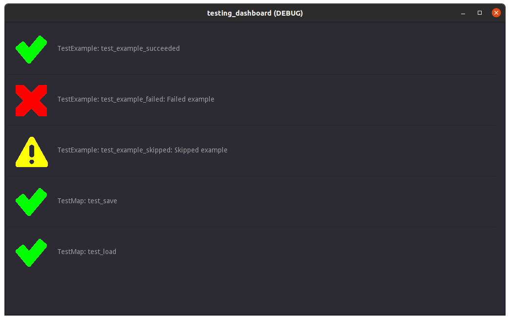

# Godot Testing Dashboard


<p align="center">
  <a href="https://godotengine.org">
    
  </a>
</p>

*A (relatively) pain-free way to test your Godot applications.*

## Quick Start

### Writing Test

Tests **must** extend `TestBase`.

```
class_name TestExample
extends TestBase
```

Functions you want to run as tests **must** have their names prefixed with `test_`. These functions **must** return a `Result`.

```
func test_example_succeeded() -> Result:
	return Result.new()


func test_example_failed() -> Result:
	return Result.new(FAILED, 'Failed example')


func test_example_skipped() -> Result:
	return Result.new(ERR_SKIP, 'Skipped example')

func test_example_succeeded() -> Result:
	return Result.new()
```


### Attaching Tests to the Runner

Follow these steps to add your test to the dashboard:

1. Open `res://tests/testing_dashboard.tscn`
2. Right-click on the `Runner` Node within the scene outliner and select "Add Child Node"
3. Select your test class as the base class.
4. (Optional) Rename the newly created node to desired `test_name` value. The name dictates what the report will set as `test_name`. 


## Deep-dive

### What is `TestBase`?

`TestBase` is the base class for all tests. As of now it's just an empty class I used to keep things organized, and if the need arises, I can extend easily.

### What is `Result`?

`Result` is a simple data container class which holds information about the results of any given test function. It contains the following properties:

* `test_name` - A string containing the name of the test. This will be the name of the class the test function is in. For example, if our test class's name is `TestExample`, any `Result` from the test will automatically have `test_name` filled by the runner to be `TestExample`.

* `test_case_name` - A string containing the name of the test function called. This makes tracing easier. It will also automatically be filled in by the runner.

* `status` - An integer value corresponding to the Godot's built-in global enum `Error` ([read about it here, scroll until you see enum Error](https://docs.godotengine.org/en/stable/classes/class_@globalscope.html#enumerations)). Your test method should fill this value in when returning a new `Result`.

* `message` - A string containing a message about the result. Usually used when an error occurs, though it can be used for successes or other statuses.

Your test case function **must** return a `Result`. The easiest way of doing this is by doing the following:

```
if failure_condition:
  var msg: String = 'Message relating to failure'
  return Result.new(INT_FROM_ERROR_ENUM, msg)

return Result.new()
```

Using the default constructor will pass in `OK` as the status and an empty string (`''`) for the message. The runner is smart enough to ignore the message if it's empty.

### What is `Runner`?

The `Runner` gathers all of the tests and runs them, generating a `Report`. This `Report` is then used by the `TestDashboard` to populate the interface. It's rather low level, relatively speaking, so you don't need to worry about it past adding Nodes to the runner in the dashboard scene.

## Extending the Dashboard

### Adding More Error Types

Error types are defined in `TestDashboard`. In this class you will find the constants `ICONS` and `ICONS_COLORS`. `ICONS` is a dictionary mapping an integer to an icon texture to display when the `Result` matches. Likewise, `ICONS_COLORS` maps this integer value to a color we use to tint the icon. You can add more icons, play with the colors, and all that fun stuff here. *You can't possibly break anything...* 

## But... why?

I ask the same question to myself everyday...

## Credits

Thanks to [KennyNL](https://kenney.nl/) for the icons.
